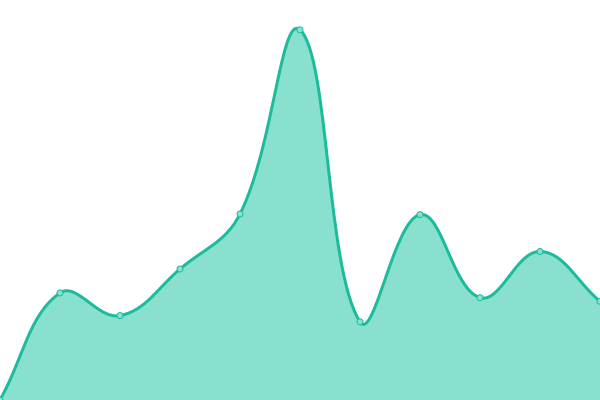

# [📈 Live Status](https://uptime.boostcode.net): <!--live status--> **🟩 All systems operational**

This repository contains the open-source uptime monitor and status page for [Lars Rathje](boostcode.net), powered by [Upptime](https://github.com/upptime/upptime).

With [Upptime](https://upptime.js.org), you can get your own unlimited and free uptime monitor and status page, powered entirely by a GitHub repository. We use [Issues](https://github.com/LRathje/Uptime/issues) as incident reports, [Actions](https://github.com/LRathje/Uptime/actions) as uptime monitors, and [Pages](https://uptime.boostcode.net) for the status page.

<!--start: status pages-->
<!-- This summary is generated by Upptime (https://github.com/upptime/upptime) -->
<!-- Do not edit this manually, your changes will be overwritten -->
<!-- prettier-ignore -->
| URL | Status | History | Response Time | Uptime |
| --- | ------ | ------- | ------------- | ------ |
|  [BoostCode](https://boostcode.net) | 🟩 Up | [boost-code.yml](https://github.com/LRathje/Uptime/commits/HEAD/history/boost-code.yml) | 

 982ms
     
 | 

<a href="https://https://uptime.boostcode.net/history/boost-code">100.00%</a>
    

|  [Ultimate, Danish Calendar](https://ultimate.dk/events-og-resultater) | 🟩 Up | [ultimate-danish-calendar.yml](https://github.com/LRathje/Uptime/commits/HEAD/history/ultimate-danish-calendar.yml) | 

 1595ms
     
 | 

<a href="https://https://uptime.boostcode.net/history/ultimate-danish-calendar">100.00%</a>
    

|  [Viamap, Falck Map, Vejhjælp](https://app.viamap.net/iframe/variant?id=97c82837-9e45-48f9-a910-15c57164db3c) | 🟩 Up | [viamap-falck-map-vejhjaelp.yml](https://github.com/LRathje/Uptime/commits/HEAD/history/viamap-falck-map-vejhjaelp.yml) | 

 3759ms
     
 | 

<a href="https://https://uptime.boostcode.net/history/viamap-falck-map-vejhjaelp">100.00%</a>
    

|  [Viamap, Map Data](https://app.viamap.net/datasaet) | 🟩 Up | [viamap-map-data.yml](https://github.com/LRathje/Uptime/commits/HEAD/history/viamap-map-data.yml) | 

 153ms
     
 | 

<a href="https://https://uptime.boostcode.net/history/viamap-map-data">100.00%</a>
    

|  [BoostMap](https://boostmap.net) | 🟩 Up | [boost-map.yml](https://github.com/LRathje/Uptime/commits/HEAD/history/boost-map.yml) | 

 971ms
     
 | 

<a href="https://https://uptime.boostcode.net/history/boost-map">100.00%</a>
    

|  [BoostMap App](https://app.boostmap.net/locations) | 🟩 Up | [boost-map-app.yml](https://github.com/LRathje/Uptime/commits/HEAD/history/boost-map-app.yml) | 

 681ms
     
 | 

<a href="https://https://uptime.boostcode.net/history/boost-map-app">100.00%</a>
    

|  [BirdMoves](https://birdmoves.com) | 🟩 Up | [bird-moves.yml](https://github.com/LRathje/Uptime/commits/HEAD/history/bird-moves.yml) | 

 737ms
     
 | 

<a href="https://https://uptime.boostcode.net/history/bird-moves">100.00%</a>
    

|  [BirdMoves App](https://app.birdmoves.com) | 🟩 Up | [bird-moves-app.yml](https://github.com/LRathje/Uptime/commits/HEAD/history/bird-moves-app.yml) | 

 638ms
     
 | 

<a href="https://https://uptime.boostcode.net/history/bird-moves-app">100.00%</a>
    

<!--end: status pages-->

[**Visit our status website →**](https://uptime.boostcode.net)

## 📄 License

- Powered by: [Upptime](https://github.com/upptime/upptime)
- Code: [MIT](./LICENSE) © [Anand Chowdhary](https://anandchowdhary.com), supported by [Pabio](https://pabio.com)
- Data in the `./history` directory: [Open Database License](https://opendatacommons.org/licenses/odbl/1-0/)
